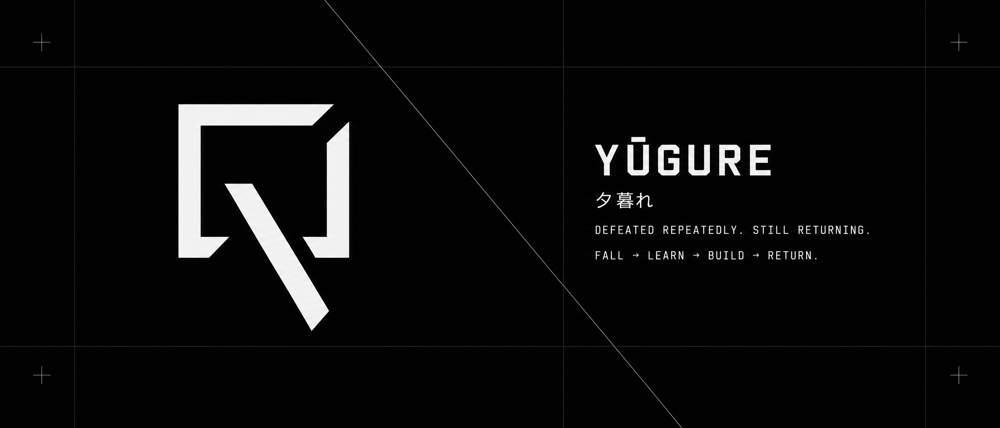

  

 

### 夕暮れ / YŪGURE

<i>Twilight · Senja</i>

 

**Defeated repeatedly. Still returning.**

`FALL` → `LEARN` → `BUILD` → `RETURN`

---

## SELECTED WORK

<table>
<tr>
<td width="70%">

### Slide-And-Cube

AI-powered puzzle experiments.

`JAVASCRIPT` · `AI` · `PUZZLE`

</td>

<td align="center">

</td>
</tr>
</table>

---

### YŪGURE / 夕

Developer · Open Source · Experiments

  

  

FALL → LEARN → BUILD → RETURN

